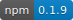
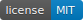

# Project Status
  

Generate a status report of your projects automatically, know the status of your dependencies and development dependencies. You know what are the dependencies that you must update. You know which dependencies you can update without risk, and what updates can make your project not work correctly.

Perform an audit to know exactly the status of all your modules.

## Prerequisites

At least it's necessary you have install

 - Node version 7.6.1 

 - Npm version 6.0.0

## Installation

Install project-status as a development dependency:

    npm install --save-dev project-status

or a global package

    npm install -g project-status

## Usage

    $ status

This command will generated a new file, STATUS.md, in your root directory with all the infomation about your project.

## Example

## Tests

    npm test

## ChangeLog

## [0.2.0] - 2017-06-20
### Added
- Added changelog to readme.
- Add GitHub information, show open issues and milestones status.
- Access GitHub information from badges.

### Changed
- Modify version badge, now is npm badge

## Author
Victor de Andrés

 - Blog: https://victordeandres.es
 - Github: https://github.com/VictorDeAndres

## License

Released under the [MIT License](http://www.opensource.org/licenses/mit-license.php).