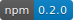
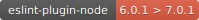
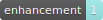
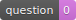

# Project Status
##### 19 July 2018
  ## project-status
Generate a status report of your projects automatically, know the status of your dependencies and development dependencies. You know what are the dependencies that you must update. You know which dependencies you can update without risk, and what updates can make your project not work correctly.

  
## Status Dependencies
### dependencies
 
### devDependencies
   
## Audit Dependencies
     
### actions

   Review "deep-extend" package, no patches are available.

   Overview: Versions of `deep-extend` before 0.5.1 are vulnerable to prototype pollution.

   Recommendation: Update to version 0.5.1 or later.
## GitHub Information
### Open Issues
 
#### Resume by tags

